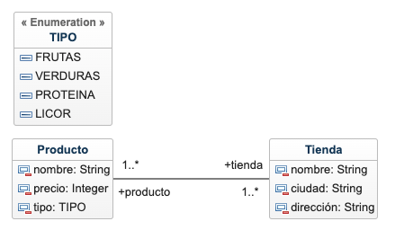

# app-nest-market_MISW4403_202315

## Modelo

 

## Collections

The folder **collections** has all collections for this API, its has examples too.

## Dockerfile y docker-compose

run Dockerfile
```shell
docker build -t dev-image . -f dev.Dockerfile
```

```shell
docker run -p 3000:3000 dev-image 
```
run docker compose
```shell
docker-compose up --build
```